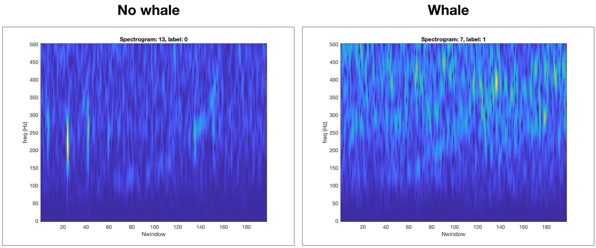
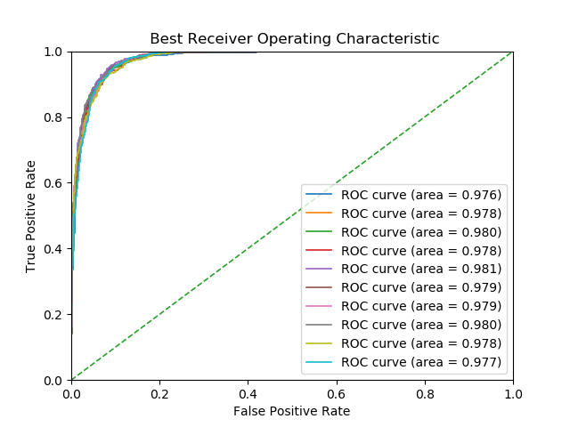
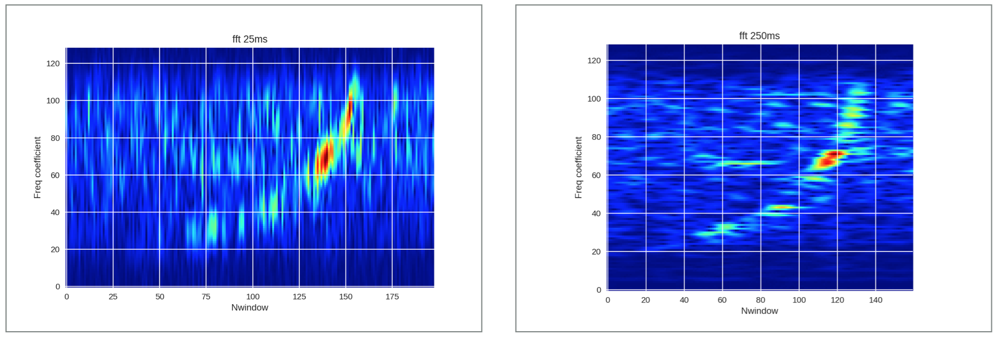
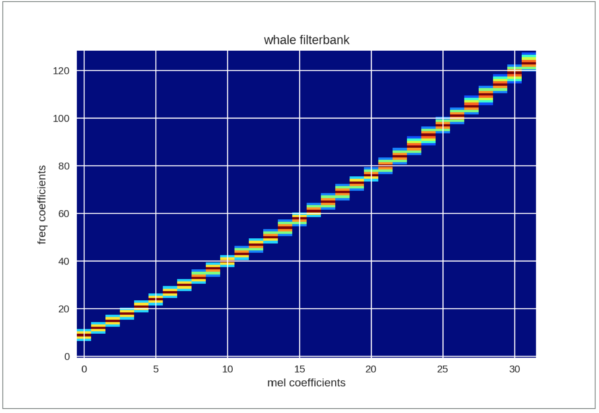
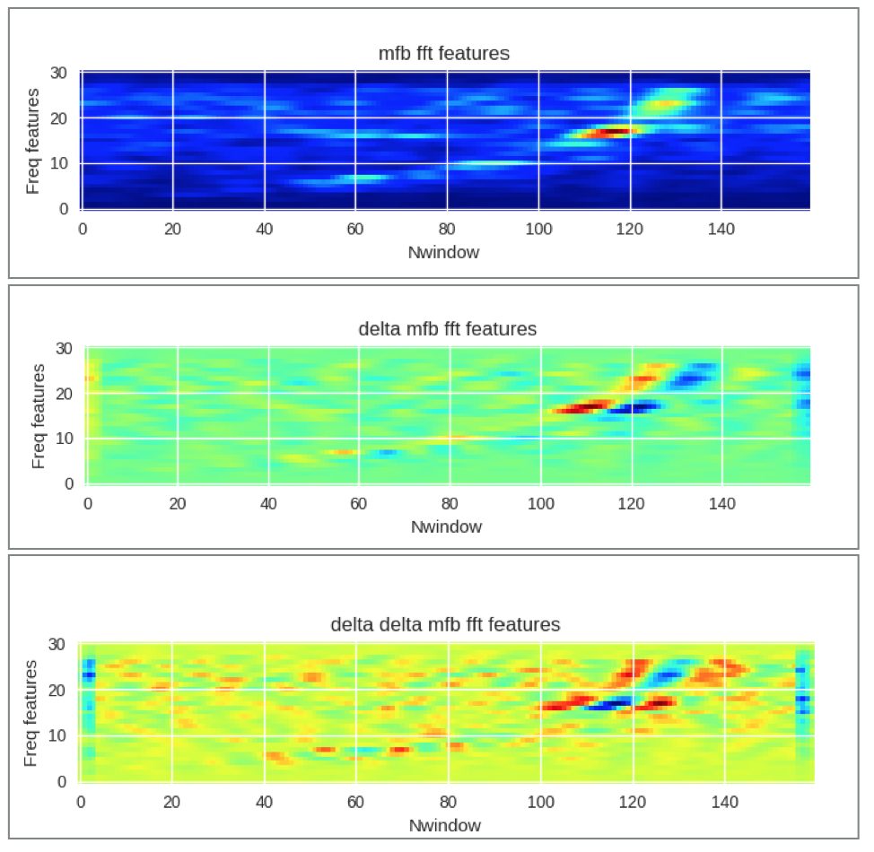
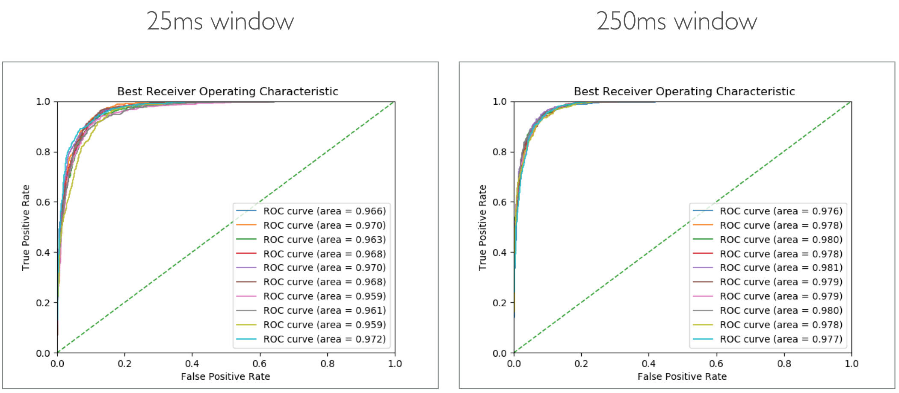

# moby-dick Whale Detection

<!--  *? Short sentence on NARW and their upcall and why finding them is important-->

This task is difficult as microphones on buoys record a lot of noise. Also, NARWs and other marine mammals have very similar
calls. This is shown in the following spectrograms.



We propose and compare three approaches to solving the
 [Kaggle Cornell Whale detection challenge](https://www.kaggle.com/c/whale-detection-challenge):
HMMs, Neural Nets, and Gradient Boosting. We also propose a feature extraction scheme for each approach.

We are provided with 30000 audio clips of 2 second duration, sampled at 2kHz.
This gives us frequency resolution up to 1kHz. NARW upcalls are generally in the range of 50-450 Hz.
We therefore apply a downsampling factor of 2 to all audio clips.
 The dataset is umbalanced with only 7027 possitive examples (23.4%).
 There are also 70000 test clips which are unlabelled.
 We do not use these as we dont have the labels, we
 will use K fold cross validation instead.

 [Here](https://vimeo.com/227009627) is a video clip showing how a NARW upcall sounds.

For a more in depth overview see the project <a href="slides/whale_presentation.pdf" download>slides</a>.

[Preparing the dataset](#preparing-the-dataset)\
[Neural network approach](#neural-networks)\
[HMM approach](#Hidden-markov-models)\
[Gradient boosting approach](#gradient-boosting)\
[Additional resources](#additional-resources)\

## Results and Evaluation

We achieve a best mean result of 0.9786 roc-auc after with a 0.0014 standard
deviation when running 10 fold cross validation using 10% of data for testing.
This result could probably be improved by ensembling the neural net with
the gradient boosted trees. Another untested option is to give the neural network
some of the features used with the gradient booster as additional inputs.

A summary of our results:


| ROC-AUC | CNN 25ms | CNN 250ms |   HMM  | Grad Boosting |
|:-------:|:--------:|:---------:|:------:|:-------------:|
|   **mean**  |  0.9656  |   0.9786  | 0.6101 |     0.9347    |
|   **std**   |  0.0045  |   0.0014  | 0.0605 |     0.004     |

ROC curves obtained with our best performing method (Neural Net with wide FFT window).



## Preparing the dataset

First download the dataset and extract the whale_data folder.
Run the following script in order to save train samples and lables to .npy files.
```bash
python read_data.py
```
This should generate two files: whale_traindata.npy and whale_trainlabels.npy. These will
be used as input to our feature extraction scripts.

## Neural Networks

We represent sound clips as spectrograms, apply some basic image processing
and feed them into our classifier CNN.

### Feature extraction

[Notebook for this section](https://github.com/JavierAntoran/moby_dick/blob/master/Notebooks/format_data_NN.ipynb)


First, the time series are separated into overlapping windows. We choose a window
size of 25ms and a time advance between window starts of 10ms. These are
typical values for speech processing. However, because of the time-frequency uncertainty
principle, with a small window, our estimation of frequency coefficient
will have more variability. This is especially true for lower frequencies,
where whale upcalls reside. For this reason, we generate a second set of features
with a 250 ms window and a 11 ms step between window starts (this values is chosen in order to
obtain a roughly similar amount of windows).

We apply a hamming window and calculate the 256 point fft of every window.
We keep the first 128 coefficients as our data is real and the rest of the
coefficients will be symmetric. The resulting spectrograms are shown in the
following plot:




We generate a filter bank of 32 filters taken the region of 40-1000 Hz. In this range,
 the MFB weighs all frequencies almost linearly, with slightly more resolution
 assigned to the lower frequencies.
 This is consistent with the energy distribution of whale upcalls.
 We choose 32 mel filter bands as maximum size of the receptive fields for individual units
 of our network will be of size 32x32. The whale filterbank matrix is shown in the following image:

 

Finally, we compute the first and second derivatives of our features with respect to time (delta features).
We stack the spectrogram and its derivates as to form channels which we will
pass as input to our CNN.




To parse the data with a 25ms window run the following commands:
```bash
cd NN_solution
python format_data_25ms.py
```

To parse the data with a 250ms window run the following commands:
```bash
cd NN_solution
python format_data_250ms.py
```

Extracted features will be saved to the /NN_solution/data directory.

### Network architecture, Training and Evaluation

We use a 9 layer fully convolutional network, a slightly modified version of the simplenet v2 architecture: https://github.com/Coderx7/SimpNet.
The global max pooling layer at the end of the network allows us to use different
sized images as input. We can use the same architecture for features
obtained with 25ms and 250ms fft windows. The input sizes as Nx3x198x32 and Nx3x196x32.

We use a 90/10% train/validation data split with 10 fold cross validation.
The resulting ROCs are shown in the following plots:




25ms window, no cross validation
```bash
cd NN_solution/delta_spectrogram_simplenet/
python run1_train.py
```
25ms window, cross validation
```bash
cd NN_solution/delta_spectrogram_simplenet/
python run2_cross_validate.py
```
250ms window, no cross validation
```bash
cd NN_solution/delta_spectrogram_simplenet/
python run3_train_widewindow.py
```
250ms window, cross validation
```bash
cd NN_solution/delta_spectrogram_simplenet/
python run4_cross_validate_widewindow.py
```

Results will be saved to the NN_solution/results directory.
Pytorch models will be saved to the NN_solution/models directory.

## Hidden Markov Models

### Feature extraction

### HMM Training and Evaluation

## Gradient Boosting

### Feature extraction

### Model Training and Evaluation

## Additional resources

An assortment of publications related to Neural Nets, HMMs, Gradient Boosting and Marine
Mamal audio detection can be found
in the [papers](https://github.com/JavierAntoran/moby_dick/tree/master/papers) folder.

* Contest winners repo: https://github.com/nmkridler/moby2
* Simplenet paper: HasanPour, Seyyed Hossein et al. “Let ’ s keep it simple : Using simple architectures to outperform deeper architectures.” (2016).
\\https://arxiv.org/pdf/1608.06037.pdf
*